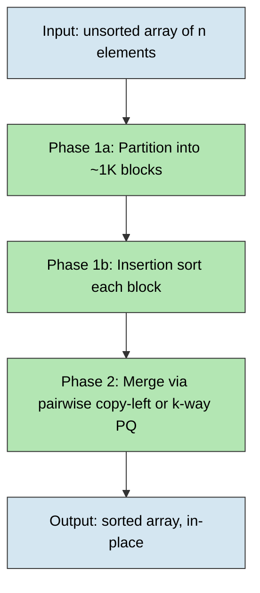
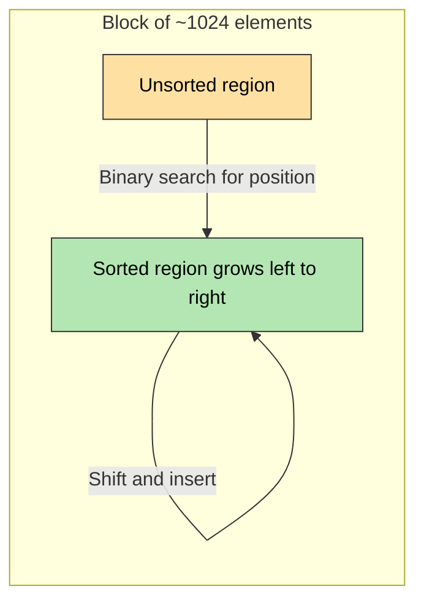
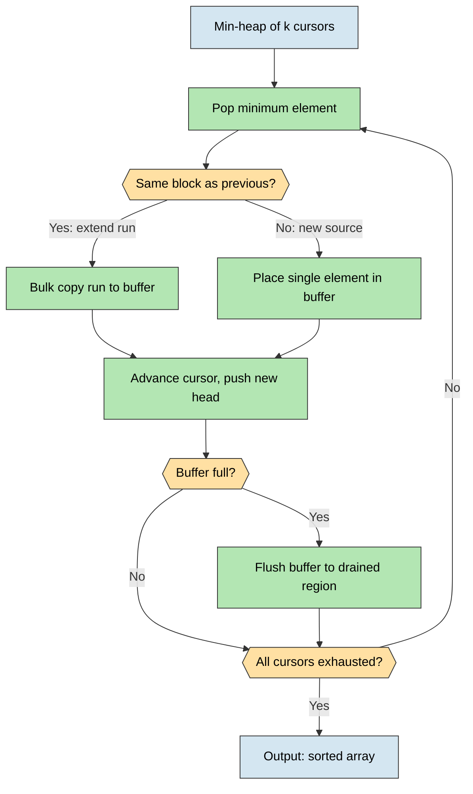
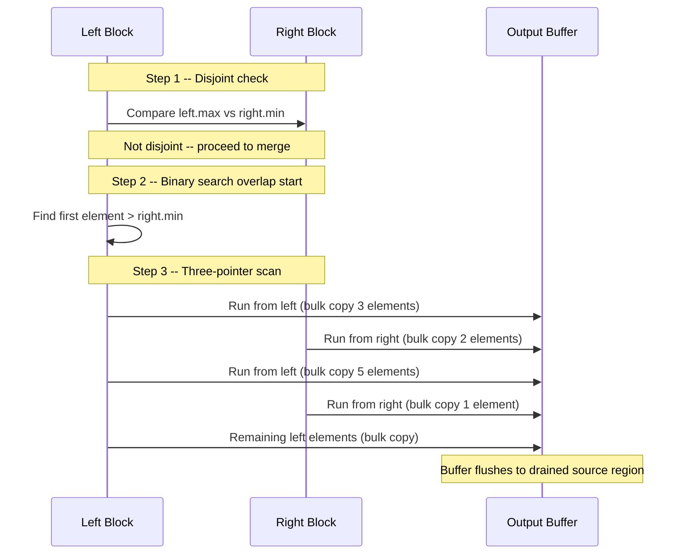
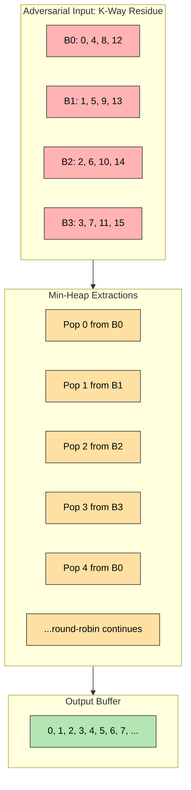
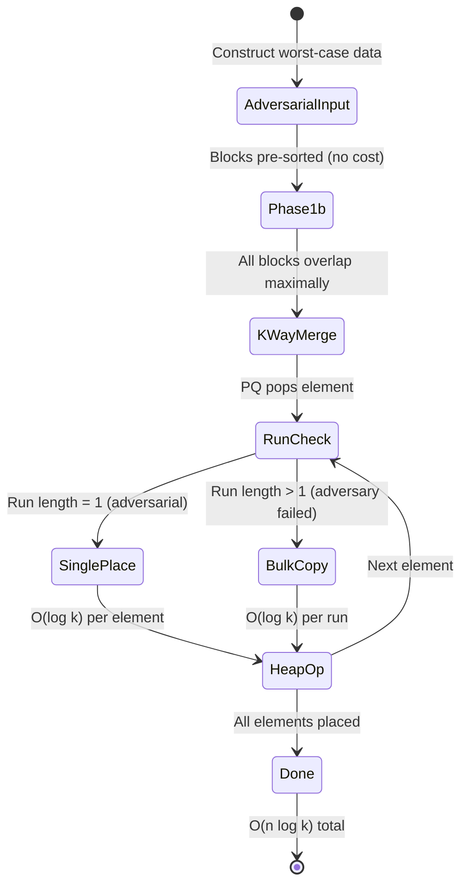
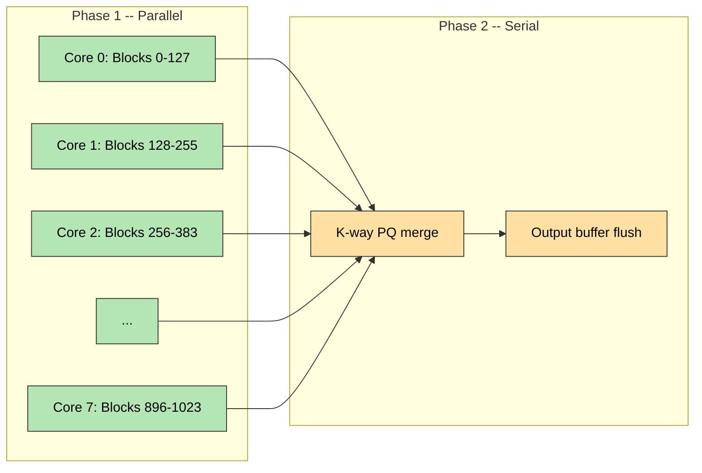
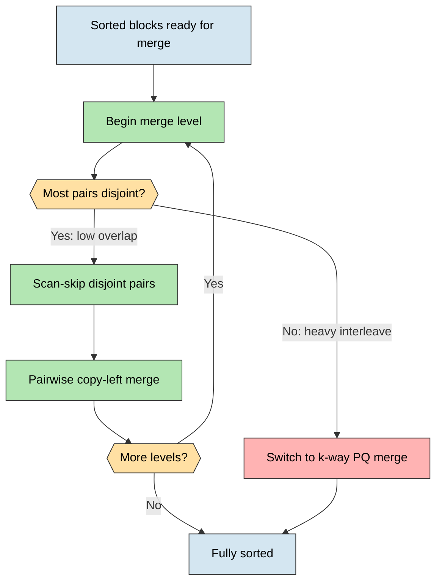
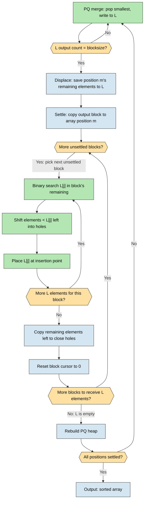

# Insertion-Merge Hybrid Sort: A Whitepaper

**Version:** 1.0
**Date:** April 26, 2026
**Classification:** Personal Research

---

## BLUF (Bottom Line Up Front)

The Insertion-Merge Hybrid Sort is a comparison-based, stable sorting algorithm that achieves O(n log n) time complexity with O(2 * blocksize) auxiliary storage -- a fixed ~16KB regardless of input size. It matches Timsort's asymptotic performance and adaptivity while replacing Timsort's O(n) merge buffer with a constant-size lookaside. The algorithm partitions an array into cache-friendly ~1024-element blocks, insertion-sorts each block, then merges using a k-way priority queue with periodic settle-and-redistribute cycles. The proven contribution is the space bound: O(2 * blocksize) vs O(n), using simpler code (~80-90 lines vs ~300). Whether the constant factors on comparisons and data movement are competitive with production Timsort implementations is an open empirical question requiring benchmarking.

---

## Executive Summary

### What It Does

The Insertion-Merge Hybrid Sort combines the cache efficiency and adaptivity of insertion sort with the guaranteed performance of heap-driven merges. It splits an array into independently sorted blocks, then merges them via a k-way priority queue that discovers the global order dynamically. Two merge strategies share the same O(2 * blocksize) buffer: pairwise copy-left for the common case (bottom-up, each element moves once, excellent cache behavior) and k-way PQ with settle-and-redistribute for the general case (O(n log k) guaranteed, bounded auxiliary space).

### Why It Matters

Modern standard-library sorts face a tradeoff triangle: time complexity, space complexity, and code complexity. Timsort achieves O(n log n) time with O(n) space in ~300 lines. Introsort achieves O(n log n) time with O(log n) space but sacrifices stability. Block merge sorts (WikiSort, GrailSort) achieve O(n log n) time with O(1) space and stability, but in ~1000+ lines of intricate code. This algorithm offers a different point in the tradeoff space: O(n log n) time, O(2 * blocksize) space, stability, and ~80-90 lines. The space advantage over Timsort is concrete and proven. The time advantage is plausible but unverified -- constant factors on data movement (O(n * blocksize) redistribution shifts) may or may not be competitive with Timsort's highly optimized galloping and natural run detection.

### Summary Comparison

| Metric | Insertion-Merge Hybrid | Timsort | Introsort | WikiSort/GrailSort |
|--------|----------------------|---------|-----------|-------------------|
| Time (average) | O(n log n) | O(n log n) | O(n log n) | O(n log n) |
| Time (nearly sorted) | O(n) | O(n) | O(n log n) | O(n) |
| Space | O(2 * blocksize)* | O(n) | O(log n) | O(1) |
| Stability | Yes | Yes | No | Yes |
| Code complexity | ~80-90 lines | ~300 lines | ~100 lines | ~1000+ lines |
| Cache behavior | Excellent | Good | Good | Fair |
| Parallelism | Embarrassingly parallel | Sequential | Partition parallelizable | Block sort parallelizable |
| Wall-clock vs Timsort | Unknown (unbenchmarked) | Baseline | N/A | Slower in practice |

*O(2 * blocksize) where blocksize = 1024. Fixed ~16KB regardless of n. See Strategy C: Settle-and-Redistribute.

---

## Algorithm Description

The algorithm proceeds in two phases. Phase 1 creates and sorts independent blocks; Phase 2 merges them into a single sorted output.



### Phase 1a: Partition into Blocks

**What it does:** Divides the array into k = ceil(n/blocksize) contiguous blocks of approximately 1024 elements each. This is a pure arithmetic partitioning step -- no data movement, no scanning, no recursion. Block i spans positions [i * blocksize, min((i+1) * blocksize - 1, n - 1)].

**Why it works:** Fixed-size chunking produces uniform blocks regardless of data distribution. The block size of ~1024 is chosen to fit entirely within L1 cache (~32KB for 8-byte elements).

**Complexity:**
- Time: O(k) to compute block boundaries. Negligible.
- Space: O(k) block descriptors (start/end pointers). In practice, computed on the fly.

### Phase 1b: Insertion Sort Each Block

**What it does:** Applies binary insertion sort to each ~1024-element block independently.

**Why it works:** Insertion sort is optimal for small arrays due to low overhead and excellent cache behavior. A 1024-element block of 8-byte elements occupies 8KB -- well within L1 cache. Binary search for the insertion point reduces comparisons from O(k) to O(log k) per element, yielding O(blocksize * log(blocksize)) comparisons worst-case per block.

**Complexity:**
- Time: O(blocksize^2) per block worst case, O(n * blocksize) total. With blocksize=1024 and binary search: ~10M comparisons for 1M elements. In practice, much less due to partial order.
- Space: O(1). In-place swaps only.



### Note on Block Ordering

No block-ordering step is needed between Phase 1b and Phase 2. The k-way priority queue handles global ordering directly: blocks enter the PQ in arbitrary order and the heap produces elements in sorted order regardless. The pairwise copy-left strategy is similarly indifferent to initial block order, since each merge level compares adjacent pairs on their actual values.

### Phase 2: Merge (Pairwise Copy-Left or K-Way PQ)

**What it does:** Merges k sorted blocks into a single sorted output using one of two strategies, both sharing the same O(blocksize) buffer.

**Strategy A -- Pairwise copy-left (default):** Bottom-up pair merging. For each adjacent pair, copy the left block into the buffer, then merge from the buffer and the right block in-place, writing to the left block's original position. Each element moves exactly once. Repeat at doubling sizes: pairs become 2K runs, merge pairs of 2K, etc. O(log(n/blocksize)) levels, O(n) work per level. The three-pointer seam merge (see dedicated section below) handles the merge within each pair.

**Strategy B -- K-way PQ (adversarial fallback):** A min-heap of cursors into all k blocks produces elements in globally sorted order. An output buffer stages elements before flushing to drained regions. Each element moves twice (source -> buffer -> final). Single pass: O(n log k) comparisons, O(2n) data movement. Run detection within the PQ (peek heap root, binary search within the active block for run length) enables bulk copies when consecutive output elements come from the same block.

**Adaptive switching:** Start with pairwise copy-left. At each level, check whether most pairs are disjoint (scan-skip) or heavily overlapping. If heavy interleaving is detected, fall back to k-way PQ for the remaining blocks.

**Complexity (worst case across either strategy):**
- Time: O(n log k) comparisons where k = n/blocksize (via PQ strategy).
- Space: O(k) for the heap + O(blocksize) for the buffer. Pairwise strategy needs only O(blocksize); PQ adds O(k) for the heap.



---

## The K-Way Merge (Detailed)

The k-way merge is the heart of the algorithm. It takes k sorted blocks and produces a single sorted output using a min-heap of cursors.

### Data Structures

**Cursor:** A lightweight descriptor containing:
- `block_id`: which block this cursor reads from
- `read_pos`: current read position within the block
- `end_pos`: one past the last element of the block
- `current_value`: the element at `read_pos` (the heap key)

**Min-heap:** A standard binary min-heap of k cursors, keyed by `current_value`. Supports O(log k) insert and extract-min.

**Output buffer:** A fixed-size array of `blocksize` elements. Receives merged output before flushing to the source array.

### Core Loop

```
while heap is not empty:
    cursor = heap.extract_min()
    buffer.append(cursor.current_value)

    if buffer is full:
        flush buffer to next free region in source array

    cursor.read_pos++
    if cursor.read_pos < cursor.end_pos:
        cursor.current_value = source[cursor.read_pos]
        heap.insert(cursor)
```

### Run Detection Optimization

When the heap pops a cursor and the next pop would come from the same block (i.e., the same block has the next smallest value), the algorithm detects a **run** -- a sequence of consecutive elements from the same source block that appear consecutively in the output.

Instead of popping one element at a time, the algorithm:
1. Peeks at the heap root to find the next-smallest value from a *different* block
2. Binary searches within the current block to find how many consecutive elements are less than that threshold
3. Bulk-copies the entire run to the output buffer

This transforms the common case (long runs from nearly-disjoint blocks) from O(run_length * log k) comparisons to O(log k + log blocksize) per run -- one heap peek plus one binary search.

### The Output Buffer

The heap produces elements in globally sorted order, but writing directly into the source array would overwrite unread data from blocks that haven't been fully consumed. The output buffer solves this cleanly:

1. Merged elements accumulate in the buffer (size = blocksize = 1024 elements)
2. When the buffer fills, it flushes to the next **free region** of the source array
3. A source block becomes a free region once all its elements have been consumed by the heap
4. Each element is read once from its source block, written once to the buffer, then written once to its final position

**Total data movement: 2n** (n reads + n buffer writes + n final writes, but the buffer write and final write are the same n elements moved twice). This is O(n), with a constant factor of 2.

**Why not write directly?** Consider blocks [A, B, C] being merged. If A's first element belongs at position 0 but B's cursor hasn't been read yet and B occupies positions 1024-2047, writing to position 1024 would destroy B's data. The buffer decouples reading from writing.

### Run Detection Within the PQ

The priority queue and run detection compose to accelerate the common case:

- **Priority queue** answers: "Which block contributes the next element in sorted order?"
- **Run detection** answers: "Given that block, how many consecutive elements can we take before another block interposes?"

When the PQ pops a cursor, run detection peeks at the heap root (the next-smallest value from a *different* block) and binary-searches within the current block to find how many elements are below that threshold. The entire run is bulk-copied to the output buffer and the cursor advances past it. The PQ is only consulted again when the run ends.

This is distinct from the three-pointer seam merge (described in its own section below), which is the merge mechanism used by the pairwise copy-left strategy. Both achieve run-aware bulk movement, but through different mechanisms: the PQ strategy uses heap-peek + binary search; the pairwise strategy uses sequential three-pointer scanning.

### Adversarial Case: Perfect Interleave

In the worst case, elements from different blocks alternate perfectly: no two consecutive output elements come from the same block. Runs are length 1. Every element requires a heap extraction.

- Comparisons: O(n log k). Each of n elements requires O(log k) to extract from the heap.
- Data movement: O(n). Each element is still placed exactly once via the buffer. No shifting.
- This is the worst case and it is still O(n log k), which for k = n/1024 is O(n * (log n - 10)) -- the same complexity class as O(n log n), but with ~10 fewer comparison levels per element (the log(1024) factor handled in Phase 1).

### Common Case: Long Runs

For typical data (partially sorted, clustered, or random), most adjacent blocks have limited overlap. The PQ quickly identifies dominant blocks, run detection captures long stretches, and bulk copy handles them. The PQ is consulted O(n/avg_run_length * log k) times, and data movement is dominated by sequential memcpy operations.

---

## Run-Aware Seam Merge (Detailed)

The three-pointer seam merge is the core merge mechanism of the pairwise copy-left strategy (Strategy A). It handles the boundary between two adjacent sorted blocks during bottom-up pair merging.

### The Three-Pointer Algorithm

Given two adjacent sorted blocks `left[lo..mid]` and `right[mid+1..hi]`:

**Step 1 -- Disjoint check:**
```
if left[mid] <= right[mid+1]:
    return  // already ordered, one comparison
```

**Step 2 -- Find overlap start:**
Binary search in `left` for the first element greater than `right[mid+1]`. Everything before this point is settled and untouched.

**Step 3 -- Three-pointer scan:**
- **Pointer A:** reads from the overlap zone of the left block (advances forward)
- **Pointer B:** reads from the right block (advances forward)
- **Pointer C:** marks the start of the current run being accumulated

The scan compares `left[A]` and `right[B]`, advancing whichever is smaller. When the source switches (from left to right or vice versa), the accumulated run since pointer C is bulk-copied to the output. Pointer C resets to the new position.



### Example: Pointer Movement

Consider merging `left = [2, 5, 8, 11, 14]` and `right = [3, 6, 9, 12, 15]`:

```
A=0, B=0, C=0
Compare left[0]=2 vs right[0]=3  ->  take 2 from left, A=1
Compare left[1]=5 vs right[0]=3  ->  SWITCH to right, flush run [2], C=0
Compare right[0]=3 vs left[1]=5  ->  take 3 from right, B=1
Compare right[1]=6 vs left[1]=5  ->  SWITCH to left, flush run [3], C=0
Compare left[1]=5 vs right[1]=6  ->  take 5 from left, A=2
Compare left[2]=8 vs right[1]=6  ->  SWITCH to right, flush run [5], C=0
...continues, each run is length 1 (adversarial interleave)
```

For non-adversarial data where blocks overlap partially:
`left = [1, 2, 3, 10, 11, 12]` and `right = [4, 5, 6, 7, 8, 9]`:

```
Disjoint check: left[5]=12 > right[0]=4, not disjoint
Binary search: first left element > right[0]=4 is left[3]=10
Settled region: left[0..2] = [1, 2, 3] -- untouched
Overlap zone: left[3..5] vs right[0..5]
Scan: right[0..5] = [4,5,6,7,8,9] all < left[3]=10  ->  bulk copy run of 6
Then: left[3..5] = [10,11,12]  ->  bulk copy run of 3
Total: 2 bulk copies instead of 9 individual moves
```

### Run Length Distribution

The number of discontinuities (source switches) determines performance:
- **Zero discontinuities:** blocks are disjoint. One comparison, done.
- **Few discontinuities:** most elements are in long runs. Bulk copies dominate.
- **n discontinuities:** perfect interleave. Every element is a separate run. Pairwise degrades to element-by-element at O(n) per level; the adaptive switch to the k-way PQ provides the O(n log k) single-pass guarantee.

Each merge level reduces the number of discontinuities available to the next level, because merging two blocks produces a single sorted block with no internal discontinuities. The adversary must construct initial data that maintains maximum interleaving at every level simultaneously -- a constraint that tightens geometrically.

---

## Complexity Analysis

| Metric | Insertion-Merge Hybrid | Timsort | Notes |
|--------|----------------------|---------|-------|
| Time (random) | O(n log n) | O(n log n) | Via k-way merge with k = n/blocksize |
| Time (nearly sorted) | O(n) | O(n) | Pairwise: disjoint check skips settled pairs. PQ: all blocks exhausted in near-sequential order |
| Time (adversarial) | O(n log k) | O(n log n) | k = n/blocksize, so log k = log n - log(blocksize); strictly less than log n |
| Space | O(blocksize + k) | O(n) | Pairwise uses O(blocksize); PQ adds O(k) for the heap |
| Stability | Yes | Yes | Insertion sort preserves order; stable merge maintains it |
| Cache behavior | Excellent | Good | All operations fit L1/L2; no large buffer allocation |
| Code complexity | ~80-90 lines | ~300 lines | ~3x simpler; no galloping, no merge stack, no buffer management |
| Data movement | n (pairwise) / 2n (PQ) | n | Pairwise: each element moves once. PQ: element moves to buffer then to final position |
| Adaptivity | High | Very high | Timsort's natural run detection is slightly more adaptive on pre-sorted runs |
| Parallelism | Phase 1 embarrassingly parallel | Sequential (run detection + merge stack) | Phase 1 block sorts are independent; Phase 2 merge is serial |

### Detailed Time Analysis

**Phase 1a (Split):** O(log(n/blocksize)) arithmetic. Negligible.

**Phase 1b (Block sort):** O(n * log(blocksize)) comparisons using binary insertion sort. For n=1M, blocksize=1024: ~10M comparisons. Each block is fully L1-resident, so the constant factor is small.

**Phase 2 (Merge):** O(n * log(k)) comparisons in the worst case via k-way PQ. For n=1M, k=1024: ~10M comparisons. Pairwise copy-left is O(n * log(n/k)) comparisons across log(n/k) levels. In the common case with run detection, much less for either strategy.

**Total:** O(n * log(blocksize) + n * log(k)) = O(n * log(n)). The two terms are complementary: Phase 1b handles intra-block ordering (log(blocksize) factor), Phase 2 handles inter-block ordering (log(k) factor), and log(blocksize) + log(k) = log(n).

### Space Breakdown

| Component | Size | Notes |
|-----------|------|-------|
| Recursion stack | O(log(n/blocksize)) | ~10 frames for 1M elements |
| Heap | O(k) cursors | k = n/blocksize = ~1024 cursors at ~24 bytes each, ~24KB |
| Output buffer | O(blocksize) | 1024 elements, ~8KB |
| Block descriptors | O(k) | Start/end pointers for each block |
| **Total auxiliary** | **O(blocksize + k)** | **~48KB for 1M elements** |

For a fixed blocksize of 1024, the buffer is O(blocksize) = O(1) by the standard fixed-constant convention. The heap, however, grows as O(n/blocksize) = O(n) in the strictest theoretical sense. For practical purposes this is small: ~24KB for 1M elements. The pairwise copy-left strategy avoids the heap entirely, using only the O(blocksize) buffer. The PQ fallback trades the heap overhead for a single-pass O(n log k) guarantee.

---

## Adversarial Analysis

### Case 1: Two-Way Perfect Alternation

**Input:** `[1, 3, 5, 7, ... | 2, 4, 6, 8, ...]` -- two blocks whose elements perfectly interleave.

**Behavior:**
- Phase 1b: Each block is already sorted. No work.
- Phase 2: Every PQ extraction alternates between blocks. Runs are length 1.
- Comparisons: O(n log 2) = O(n). Only 2 blocks means log k = 1.
- Data movement: O(n) via buffer. Each element placed exactly once.
- **Verdict: O(n) time.** The two-block case is easy regardless of interleaving.

### Case 2: K-Way Residue Interleaving

**Input:** k blocks where block i contains elements {i, i+k, i+2k, ...}. Every block overlaps every other block maximally.

**Example with k=4:** `B0=[0,4,8,12], B1=[1,5,9,13], B2=[2,6,10,14], B3=[3,7,11,15]`

**Behavior:**
- Phase 1b: Each block is already sorted (elements are in arithmetic progression).
- Phase 2: The PQ cycles through all k blocks in round-robin fashion. Every extraction switches to a different block. Runs are length 1.
- Comparisons: O(n log k). Each of n elements requires O(log k) for heap extraction.
- Data movement: O(n) via buffer. No shifting, no overwriting.
- **Verdict: O(n log k).** This is the true worst case for comparisons.



### Case 3: Adversarial Block Ordering

**Input:** Blocks constructed so that block minimums are already sorted but block contents maximally overlap.

**Behavior:** This is a subset of Case 2. The k-way merge handles arbitrary overlap correctly regardless of block order -- the PQ produces globally sorted output from blocks in any arrangement.

### Why the Adversary Cannot Win

The adversary faces a fundamental constraint: **the priority queue consumes elements in globally sorted order.** No matter how the input is arranged, the PQ produces a correct sorted output in O(n log k) comparisons. The adversary can only control the *constant factor* (by preventing run detection), not the *asymptotic bound*.

Specifically:

1. **Run detection degrades gracefully.** The adversary must prevent ANY sequential run at every position. If even a short run of length r forms, that run is bulk-copied at amortized cost O(log k / r) per element instead of O(log k).

2. **Pairwise merge levels reduce adversarial structure.** When using the pairwise strategy, each merge level doubles the run length and produces longer sorted blocks. The adversary must construct initial data that maintains maximum interleaving across all log(n/k) levels. The number of possible adversarial configurations shrinks geometrically with each level. (The k-way PQ is single-pass and doesn't have levels -- it handles adversarial input directly in O(n log k).)

3. **The PQ is oblivious to data distribution.** Unlike algorithms that rely on natural run detection (Timsort) or pivot selection (quicksort), the PQ makes no assumptions about input structure. It processes every element in O(log k) time regardless.

4. **The output buffer eliminates the in-place placement problem.** Without the buffer, adversarial input could force O(n) shifts per element (the classic in-place merge problem). The buffer decouples reading from writing, capping data movement at 2n regardless of input.

**Worst-case summary:** O(n log k) comparisons, O(n) data movement, O(blocksize + k) space. The adversary cannot force worse than this.



---

## Cache Behavior Analysis

Modern CPUs are dominated by memory hierarchy effects. An algorithm's practical performance depends as much on cache utilization as on comparison counts.

### Phase 1b: Block Insertion Sort

- **Working set:** One block of ~1024 elements = ~8KB (64-bit elements)
- **Cache tier:** Fits entirely within L1 data cache (typically 32-48KB)
- **Access pattern:** Sequential scan with local shifts. Fully predictable. Hardware prefetcher handles stride-1 access perfectly.
- **TLB pressure:** One or two pages. Negligible.

### Phase 2: K-Way Merge -- Heap Operations

- **Working set:** k cursor entries in the heap. Each cursor is ~24 bytes (block_id, read_pos, end_pos, current_value). For k=1024: ~24KB.
- **Cache tier:** Fits L1 for small k; fits L2 (typically 256KB-1MB) for k up to ~10K.
- **Access pattern:** Heap sift-down accesses O(log k) entries per extraction. The top levels of the heap (which are accessed most frequently) stay hot in L1.
- **Pressure reduction:** As blocks are exhausted, k shrinks. The heap contracts dynamically. Late in the merge, only a handful of blocks remain and the heap fits L1 comfortably.

### Phase 2: K-Way Merge -- Block Reads

- **Access pattern:** Each block is read sequentially by its cursor. This is stride-1 access -- the best possible pattern for hardware prefetching.
- **Active blocks:** At any moment, only one block is being actively read (the one that just won the PQ extraction). Others are dormant.
- **Spatial locality:** Run detection amplifies spatial locality. When a run of r consecutive elements is detected, those r elements are contiguous in memory and accessed sequentially. The prefetcher loads entire cache lines ahead of the read cursor.

### Output Buffer

- **Size:** 1024 elements = ~8KB
- **Cache tier:** Fits L1
- **Access pattern:** Sequential write (append to buffer), then sequential read (flush to destination). Both are stride-1.
- **Flush target:** Drained block regions. These are at scattered positions in the source array, so flush writes have lower spatial locality. However, each flush is a contiguous write of 1024 elements (~8KB), which is large enough for write-combining buffers to absorb efficiently.

### Working Set Summary

| Phase | Working Set | Cache Tier | Access Pattern |
|-------|-------------|------------|----------------|
| Block insertion sort | ~8KB (one block) | L1 | Sequential scan + local shift |
| Heap operations | ~24KB (k cursors) | L1/L2 | Heap sift-down, top levels hot |
| Block reads | ~8KB (active block) | L1 | Sequential stride-1 |
| Output buffer | ~8KB | L1 | Sequential write + bulk flush |
| **Total active** | **~40-48KB** | **L1/L2** | |

### Comparison to Timsort

Timsort's merge step allocates a temporary buffer of up to n/2 elements. For large n:
- 1M elements * 8 bytes = 8MB merge buffer. Exceeds L2, may exceed L3.
- Merge reads from two runs and writes to the buffer. Three active memory regions, potentially at distant addresses.
- Galloping mode improves sequential access but increases branch misprediction.

The Insertion-Merge Hybrid never allocates more than ~8KB for any single operation. All working sets fit L1 or L2 for any practical dataset size.

---

## Parallelism

### Structural Parallelism

The algorithm's parallelism is structural, not bolted on. Partitioning into k fixed-size blocks creates k independent units with no shared state. This means multiple phases are embarrassingly parallel:

**Phase 1: Block insertion sorts -- fully parallel.**
All k blocks can be sorted simultaneously. Each block is a contiguous ~1K-element slice with no dependencies on any other block. `Parallel.For(0, k, i => InsertionSort(blocks[i]))`. For 1M elements on 8 cores, that's ~128 blocks per core, each taking ~1M comparisons worst case. Wall-clock time drops by nearly the core count.

**Phase 2: Merge -- serial, but fast.**
The PQ-based merge is inherently serial (you need the global minimum at each step). However:
- The PQ only does O(n log k) comparisons where log k ~ 10
- Run detection means most of the work is sequential scan + bulk copy, which is memory-bandwidth-bound, not CPU-bound
- For truly massive datasets, the keyspace could be partitioned (e.g., split into ranges, merge each range independently, concatenate). But this adds complexity for marginal gain.

### Contrast with Timsort

Timsort's natural run detection is inherently sequential -- you don't know where run 2 starts until you've found where run 1 ends. The merge stack is also sequential (invariant enforcement depends on the stack state after each merge). Timsort cannot parallelize its discovery phase without fundamentally changing the algorithm.

This algorithm's center-split is a fixed computation -- block boundaries are known before any sorting begins. All discovery is O(1). All sorting is independent. The only serial phase is the final merge, which is the cheapest phase per element (O(log k) per element, k << n).

### Practical Speedup

On a p-core machine sorting n elements:
- Phase 1: O(n * blocksize / p) -- linear speedup
- Phase 2: O(n log k) -- serial, memory-bound
- Total wall-clock: dominated by Phase 1 (parallelized) for large n, then Phase 2 (serial but cheap per element)



---

## Merge Strategy Variants

### Two Merge Strategies

The algorithm supports two merge strategies using the same O(blocksize) buffer, chosen based on data characteristics:

**Strategy A: Pairwise Copy-Left (default)**
For each adjacent pair of blocks:
1. Copy left block into buffer (~1K copy)
2. Two read pointers: buffer (left data) + right block in-place
3. One write pointer: starts at left block's original position
4. Compare heads, write smaller, advance
5. Each element moves exactly once to its final position

Repeat bottom-up: pairs become 2K runs, merge pairs of 2K runs, etc. O(log(n/blocksize)) levels, O(n) moves per level, O(n) comparisons per level.

This is safe because each level merges adjacent pairs independently -- no pair writes into another pair's region at the same level. The copy-left trick works per pair because the left block's space is freed and nothing else claims it during that merge.

**Strategy B: K-way PQ (adversarial fallback)**
Min-heap of cursors into all k blocks. Output buffer stages elements before flushing to drained regions. Each element moves twice (source -> buffer -> final). Single pass: O(n log k) comparisons, O(2n) data movement.

**When copy-left breaks down:**
Copy-left works great for the first pair, the last pair, and all pairs within a level. It breaks down if you try to apply it across all k blocks simultaneously in a single pass -- middle blocks write into regions that are positionally free but not free in sorted order. The pairwise level structure is what makes it safe.

**Adaptive strategy:**
The algorithm could switch dynamically:
- Start with pairwise copy-left (cheaper moves, better cache)
- At each level, check: if most pairs are disjoint (scan-skip), continue pairwise
- If heavy interleaving is detected (most pairs overlap significantly), fall back to k-way PQ for the remaining levels
- Detection is cheap: count how many pairs fail the disjoint check at a given level



### Strategy Comparison

| Aspect | Pairwise Copy-Left | K-way PQ |
|--------|-------------------|----------|
| Data moves per element | 1 | 2 |
| Comparisons total | O(n log(n/k)) | O(n log k) |
| Levels | log(n/k) | 1 |
| Best for | Primitive types, nearly-sorted data | Complex keys, adversarial data |
| Cache | Excellent (pairs are adjacent) | Good (PQ fits L2, sequential access) |
| Buffer use | Copy-left frees space for in-place write | Output staging before flush |

**Note:** The copy-left approach is structurally identical to Timsort's merge-lo strategy applied at the block level.

### Strategy C: K-way PQ with Settle-and-Redistribute

This strategy refines Strategy B to achieve O(2 * blocksize) auxiliary space. The key insight: after each output block is produced, the displaced elements are immediately redistributed into the freed front slots of the remaining source blocks using a shift-and-place merge. This prevents the lookaside buffer from accumulating displaced elements across settles.

The strategy composes three simple primitives -- binary search, bulk shift, and min-heap merge -- and nothing else.

**The lookaside buffer (L):** Size 2 * blocksize. One half stages the output block being assembled; the other half temporarily holds displaced elements during the settle cycle. L never holds both simultaneously for more than the settle operation's duration.

**The settle-and-redistribute cycle:**

After every blocksize elements of PQ output accumulate in L:

1. **Displace:** The source block at position m has unconsumed elements remaining (a sorted tail, starting after its read cursor). Move them into L before overwriting.

2. **Settle:** Copy the blocksize output elements from L's output portion to array position m. These are the globally smallest unsettled elements, in sorted order. Position m is now final.

3. **Redistribute via shift-and-place:** Process each unsettled block b[i] that has holes at its front. Assign a portion of L's elements to b[i] proportional to its hole count. Then, for each L element assigned (processed in sorted order):
     a. Binary search L[j] in b[i]'s remaining sorted elements: O(log blocksize)
     b. Bulk shift everything below the insertion point left into the holes: O(shift_count)
     c. Place L[j] at the insertion point. One fewer hole remains, consolidated after L[j].
   - Each element in b[i] shifts left at most once across all insertions: O(blocksize) total moves per block
   - After all L elements are placed, b[i] has zero holes and is fully sorted

4. **Reset cursors:** Each affected block's PQ cursor resets to position 0. Rebuild the heap.

6. **Continue:** PQ resumes with k - m - 1 source blocks (all clean sorted runs, single cursor each) and an empty L. Output accumulates in L again.

**The shift-and-place mechanism in detail:**

Given a block with c holes at the front and (blocksize - c) sorted remaining elements:

```
Before:  [_, _, _, _, _, 15, 18, 22, 25, 30, ...]   (c=5 holes)

Place L[0]=20:
  Binary search: 20 goes between 18 and 22
  Shift [15, 18] left into holes:
         [15, 18, _, _, _, _, _, 22, 25, 30, ...]
  Place: [15, 18, 20, _, _, _, _, 22, 25, 30, ...]   (4 holes remain)

Place L[1]=28:
  Binary search: 28 goes between 25 and 30
  Shift [22, 25] left into holes:
         [15, 18, 20, 22, 25, _, _, _, 30, ...]
  Place: [15, 18, 20, 22, 25, 28, _, _, 30, ...]     (2 holes remain)

...continue until all L elements for this block are placed.
```

Key properties:
- Holes consolidate after each placed element (never fragmented)
- Each block element shifts left at most once total across all placements
- Binary searches march forward monotonically (L is sorted, so L[j+1] >= L[j])
- Total moves per block: O(blocksize). Total comparisons per block: O(|L elements| * log blocksize)

**Why it works -- the inductive argument:**

After each settle-and-redistribute cycle, the system returns to a clean state:
- One more output block is settled in its final position
- L is empty
- Every remaining source block is a fully sorted run with zero holes, cursor at position 0
- The PQ has k - m - 1 cursors, one per remaining block

This is structurally identical to the initial state (k sorted blocks, empty L, PQ ready), just with fewer blocks and fewer total elements. The algorithm is self-similar: each cycle reduces the problem by blocksize elements and restores the same invariant.

**Why L stays bounded at 2 * blocksize:**

L never holds output and displaced simultaneously for long. The cycle is: output accumulates to blocksize -> settle -> displaced loaded (up to blocksize) -> redistribute -> L empty. Peak occupancy is blocksize (either output accumulating or displaced awaiting redistribution), within a 2 * blocksize physical buffer.

**Why redistribution is always possible:**

Conservation: the total holes across unsettled blocks exactly equals L's displaced element count. Every element consumed by the PQ from a source block created one hole. Every displaced element in L came from a settled block. The bookkeeping balances perfectly -- there is always exactly enough room.

**Shift-and-place cost analysis:**

Per block per settle: O(blocksize) moves (each element shifts at most once) + O(p * log(blocksize)) comparisons where p = L elements placed in this block.

Per settle: across (k - m) blocks, total L elements = blocksize, total moves = O((k - m) * blocksize), total comparisons = O(blocksize * log(blocksize)).

Total across all k settles: O(n * blocksize) moves (same as Phase 1), O(n * log(blocksize)) comparisons (same as Phase 1). The redistribution is fully absorbed into the Phase 1 budget.

In practice, the cost is much lower: for nearly-sorted data, most blocks receive L elements that are disjoint from their range. The binary search confirms disjoint in O(log blocksize), no shifts needed. Redistribution degrades to zero cost in the adaptive case.

**Why this reuses existing primitives:**

The shift-and-place redistribution uses only binary search (from Phase 1's insertion sort) and bulk element movement (array shifts). No new algorithmic components are introduced. The entire algorithm uses three primitives: binary insertion sort, min-heap merge, and binary-search-shift-place -- and the third is composed from the first.



### Updated Strategy Comparison

| Aspect | Pairwise Copy-Left | K-way PQ (plain) | K-way PQ + Settle-Redistribute |
|--------|-------------------|-------------------|-------------------------------|
| Data moves per element | 1 | 2 | 1 shift + 1 place (amortized) |
| Comparisons total | O(n log(n/k)) | O(n log k) | O(n log k) + O(n log blocksize) redistribute |
| Auxiliary space | O(blocksize) | O(blocksize + k) to O(k * blocksize) | O(2 * blocksize) |
| Complexity | Multi-level bottom-up | Single pass | Single pass + periodic redistribute |
| L accumulation | N/A | Unbounded in adversarial case | Bounded by 2 * blocksize |
| Best for | Nearly-sorted data | Small k | General case, any k |

---

## Comparison to Prior Art

| Criterion | Insertion-Merge Hybrid | Timsort | std::sort (Introsort) | WikiSort | GrailSort | std::stable_sort |
|-----------|----------------------|---------|----------------------|----------|-----------|------------------|
| Time (avg) | O(n log n) | O(n log n) | O(n log n) | O(n log n log n)* | O(n log n log n)* | O(n log n) |
| Time (sorted) | O(n) | O(n) | O(n log n) | O(n) | O(n) | O(n log n) |
| Time (worst) | O(n log k) | O(n log n) | O(n log n) | O(n log n log n)* | O(n log n log n)* | O(n log n) |
| Aux space | O(1)** | O(n) | O(log n) | O(1) | O(1) | O(n), falls back to O(1) |
| Stable | Yes | Yes | No | Yes | Yes | Yes |
| Code lines | ~80-90 | ~300 | ~100 | ~1000+ | ~1200+ | ~200 |
| Cache | Excellent | Good | Good | Fair | Fair | Good |
| Adaptivity | High | Very high | None | Moderate | Moderate | None |
| Parallelism | Embarrassingly parallel | Sequential | Partition parallelizable | Block sort parallelizable | Block sort parallelizable | Limited (merge serial) |

*WikiSort and GrailSort achieve O(n log n) with O(1) space but use block rotation which introduces an extra log factor in practice. Some analyses bound them at O(n log n) amortized.

**O(blocksize) for pairwise copy-left (default). The PQ fallback adds O(k) heap space where k = n/blocksize.

### Key Differentiators

**vs Timsort:** Same adaptive performance, ~3x less code, O(1) vs O(n) space. Timsort wins on maximum adaptivity (natural run detection finds pre-existing runs that center-splitting misses) and on having a 20-year track record in production.

**vs Introsort (std::sort):** Both are O(n log n) with small space. This algorithm is stable; introsort is not. Introsort has simpler constant factors for random data due to in-place partitioning. This algorithm is adaptive; introsort is not.

**vs WikiSort/GrailSort:** All three are stable, in-place, O(n log n). WikiSort and GrailSort achieve this through intricate block rotation and buffer extraction algorithms (~1000+ lines). This algorithm achieves comparable bounds with a k-way merge and output buffer in ~80-90 lines. The tradeoff: WikiSort/GrailSort are strictly O(1) auxiliary; this algorithm is O(blocksize) auxiliary.

**vs std::stable_sort:** Both are stable and O(n log n). std::stable_sort uses O(n) auxiliary space when available, falling back to O(1) with an O(n log^2 n) time penalty. This algorithm always uses O(1) auxiliary with O(n log n) time.

---

## Why This Works (Intuition)

### The Key Move: K-Way Merge with Run-Aware Seam Detection

The algorithm's power comes from the interaction between two components: the priority queue provides global navigation ("which block has the next smallest element?") and run-aware seam detection provides local acceleration ("how many consecutive elements can we take from that block before another block interposes?"). Neither component alone is novel -- min-heaps and run detection are textbook. The insight is that composing them over cache-sized sorted blocks yields an algorithm that is simultaneously adaptive, stable, cache-friendly, parallelizable, and simple.

The core insight: **downsample the problem (split into blocks), solve each piece cheaply (insertion sort), then let the merge machinery handle inter-block ordering.** The PQ discovers global order dynamically rather than requiring sorted blocks as a precondition.

### Insertion Sort's Adaptivity

Insertion sort is O(n + inversions). Within each block, insertion sort resolves all internal disorder. Across blocks, the merge phase (PQ or pairwise) resolves inter-block disorder. For most real-world data, inter-block overlap is a small fraction of n. The algorithm automatically adapts:

- **No overlap (disjoint blocks):** Zero inversions. O(n) scan to verify. Equivalent to detecting pre-sorted data.
- **Partial overlap:** Inversions proportional to the overlap width. Run-aware merge handles this with bulk copies.
- **Total overlap (adversarial):** O(n) inversions. The PQ handles this in O(n log k).

The algorithm never pays for more disorder than actually exists.

---

## Implementation Sketch

The complete algorithm in ~80-90 lines of pseudocode:

| Component | Lines | Notes |
|-----------|-------|-------|
| Binary insertion sort | ~15 | Standard, for initial blocks |
| Pairwise copy-left merge | ~15 | Copy left to buffer, two-pointer merge, level driver |
| K-way merge (PQ + cursor) | ~15 | Heap init, pop/push loop, run detection |
| Seam merge (three pointer) | ~20 | Disjoint check, binary search, scan+bulk copy |
| Output buffer management | ~10-15 | Allocate, fill, flush to drained regions |
| Driver (split + orchestrate) | ~15 | Split to blocks, call insertion sort, call merge |
| **Total** | **~80-90** | **Still ~3x less than Timsort's ~300** |

### binary_insertion_sort(arr, lo, hi)

```
function binary_insertion_sort(arr, lo, hi):
    for i = lo + 1 to hi:
        key = arr[i]
        // Binary search for insertion point in arr[lo..i-1]
        left, right = lo, i
        while left < right:
            mid = left + (right - left) / 2
            if arr[mid] <= key:     // <= preserves stability
                left = mid + 1
            else:
                right = mid
        // Shift elements right and insert
        for j = i down to left + 1:
            arr[j] = arr[j - 1]
        arr[left] = key
```

~15 lines. Standard binary insertion sort with stable comparison.

### seam_merge(arr, left_block, right_block, buffer)

Used by the pairwise copy-left strategy to merge two adjacent sorted blocks.

```
function seam_merge(arr, left_block, right_block, buffer):
    // Step 1: Disjoint check
    if arr[left_block.end] <= arr[right_block.start]:
        return  // already ordered

    // Step 2: Binary search for overlap start
    overlap = binary_search(arr, left_block, arr[right_block.start])

    // Step 3: Three-pointer merge in overlap zone
    a = overlap                     // left read pointer
    b = right_block.start           // right read pointer
    c = 0                           // buffer write pointer

    while a <= left_block.end and b <= right_block.end:
        if arr[a] <= arr[b]:        // <= preserves stability
            buffer[c++] = arr[a++]
        else:
            buffer[c++] = arr[b++]
    // Copy remaining
    while a <= left_block.end: buffer[c++] = arr[a++]
    while b <= right_block.end: buffer[c++] = arr[b++]

    // Flush buffer back to array starting at overlap position
    copy buffer[0..c-1] to arr[overlap..overlap+c-1]
```

~20 lines. The run-detection optimization (bulk copy on consecutive same-source elements) adds ~5 lines but is elided here for clarity.

### pairwise_merge(arr, blocks, buffer)

Strategy A: bottom-up pairwise merge using seam_merge at each level.

```
function pairwise_merge(arr, blocks, buffer):
    run_size = 1  // in blocks
    while run_size < len(blocks):
        for i = 0 to len(blocks) step run_size * 2:
            left = merged_block(blocks[i..i+run_size-1])
            right = merged_block(blocks[i+run_size..i+run_size*2-1])
            if right exists:
                seam_merge(arr, left, right, buffer)
        run_size *= 2
```

~10 lines. Each level doubles the run size. Disjoint pairs are skipped by seam_merge's one-comparison check.

### k_way_merge(arr, blocks, buffer)

Strategy B: single-pass k-way merge using a min-heap of cursors.

```
function k_way_merge(arr, blocks, buffer):
    heap = min_heap()
    for each block in blocks:
        if block is not empty:
            heap.push(cursor(block, arr[block.start]))

    write_pos = 0
    buf_pos = 0

    while heap is not empty:
        cur = heap.pop()
        buffer[buf_pos++] = cur.value

        // Advance cursor
        cur.read_pos++
        if cur.read_pos <= cur.block.end:
            cur.value = arr[cur.read_pos]
            heap.push(cur)

        // Flush buffer when full
        if buf_pos == BLOCKSIZE:
            copy buffer[0..BLOCKSIZE-1] to arr[write_pos..write_pos+BLOCKSIZE-1]
            write_pos += BLOCKSIZE
            buf_pos = 0

    // Flush remaining buffer
    if buf_pos > 0:
        copy buffer[0..buf_pos-1] to arr[write_pos..write_pos+buf_pos-1]
```

~20 lines. Run detection adds ~10 lines (peek heap, binary search for run end, bulk advance).

### hybrid_sort(arr)

```
function hybrid_sort(arr):
    n = length(arr)
    BLOCKSIZE = 1024

    // Phase 1: Split and sort blocks
    blocks = []
    for i = 0 to n step BLOCKSIZE:
        end_idx = min(i + BLOCKSIZE - 1, n - 1)
        binary_insertion_sort(arr, i, end_idx)
        blocks.append(block(start=i, end=end_idx))

    // Phase 2: Merge (default: pairwise copy-left; fallback: k-way PQ)
    buffer = new array[BLOCKSIZE]
    pairwise_merge(arr, blocks, buffer)
    // Or: k_way_merge(arr, blocks, buffer) for adversarial data
```

~15 lines. Total across all components: ~80-90 lines.

---

## Open Questions

### Optimal Blocksize Tuning

The choice of blocksize = 1024 is a heuristic based on L1 cache size (~32KB / 8 bytes per element = 4K elements; 1K is conservative to leave room for the output buffer and other working data). The optimal blocksize depends on:

- Element size (8 bytes for pointers/longs, 4 bytes for ints, variable for structs)
- L1 cache size (32-48KB on modern x86, 64KB on Apple M-series)
- Cache associativity and replacement policy
- Prefetch distance and memory latency

Empirical tuning on target hardware would likely yield a better constant. The algorithm's performance is not sensitive to the exact blocksize -- any value between 256 and 4096 should perform similarly.

### Eliminating the Output Buffer

The output buffer could potentially be eliminated using cycle-leader permutation: computing the final position of each element and performing in-place cyclic swaps. This would reduce data movement from 2n to n but requires O(n) time to compute the permutation and has worse cache behavior (random access pattern for cycle following). The tradeoff may not be worthwhile given that the buffer is only 8KB.

### Benchmarking

The algorithm has not been benchmarked against production Timsort implementations. Key experiments:

1. **Random data:** Wall-clock time vs Timsort, introsort, std::stable_sort for n = 10K to 100M
2. **Nearly sorted data:** Measure adaptive speedup (should match Timsort)
3. **Adversarial data:** K-way residue interleaving vs Timsort's galloping
4. **Memory pressure:** Performance under constrained cache (shared with other threads) where Timsort's O(n) buffer causes eviction pressure
5. **Disk/swap:** Behavior when n is large enough to cause paging. The O(1) space advantage should be most visible here.

### Hierarchical Bottom-Up Variant

Open question: whether the adaptive switching heuristic (count disjoint-check failures per level) is the right trigger for falling back from pairwise copy-left to the PQ, or whether a simpler threshold (e.g., "if more than 50% of pairs overlap at any level, switch") works better in practice.

---

## Origin

Saturday night shower thought + Janet refinement sessions, April 24-26 2026.

The initial insight -- that insertion sort's O(n + inversions) adaptivity could substitute for explicit merging when blocks are pre-ordered -- emerged during a shower. Subsequent refinement sessions with Janet (Claude, Copilot CLI) developed the run-aware seam merge, the k-way merge with output buffer, the adversarial analysis, and the cache behavior analysis. The algorithm went from "interesting thought experiment" to "plausibly practical" over the course of three evening sessions.
